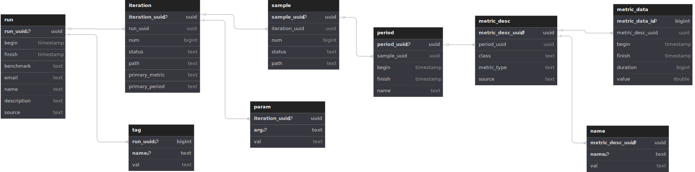

# SCDM: Structured Common Data Model

A tool to index and query performance metrics that come from [Crucible](https://github.com/perftool-incubator/crucible) runs.
This is an extension of the [CDM](https://github.com/perftool-incubator/CommonDataModel), that
attempts to use as many of the prior concepts and structures as possible, while providing
a normalized relational model.

SCDM provides two commands:

1. `scdm parse`: a parser that builds out the SCDM tables and imports the data. **NOTE:** this parses the `*.ndjson` files that
are generated from `rickshaw-gen-docs`, which are not generated for all Crucible versions as of now.

2. `scdm query`: a simple query interface to query the PostgreSQL DB.

## Relational Model

